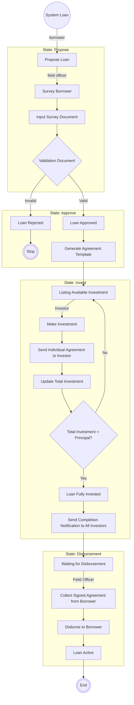
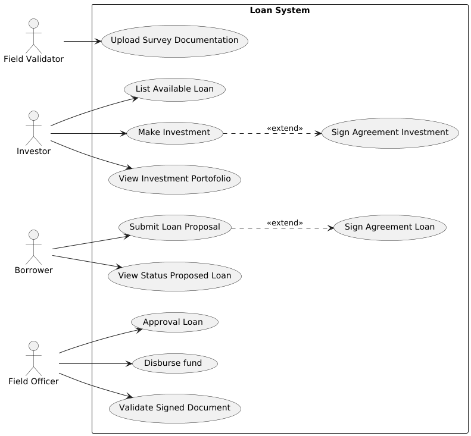

# Loan Engine - 📋 Summary Requirements
## Core Business Rules
- **State Flow**: `proposed` → `approved` → `invested` → `disbursed`
- **Forward-only movement**: No backward state transitions allowed
- **Multiple investors**: Each loan can have multiple investors with individual amounts
- **Investment constraint**: Total invested amount cannot exceed loan principal
- **Auto state transition**: Loan becomes `invested` when total investment equals principal

### Workflow e2e

---
## Usecase Diagram

Based on use case diagram, below are feature we will provide.

## Feature List

### 1. Loan Lifecycle Management
**Description**: Core loan workflow management from proposal to disbursement.

**API:**
- `POST /api/v1/loans` - Create loan proposal
- `GET /api/v1/loans/{id}` - Get loan details
- `PUT /api/v1/loans/{id}/approve` - Approve loan (PROPOSED → APPROVED)
- `PUT /api/v1/loans/{id}/disburse` - Disburse loan (INVESTED → DISBURSED)

---

### 2. Investment Management
**Description**: Handle multiple investor investments with real-time aggregation and automatic state transitions.

**API:**
- `GET /api/v1/loans/available` - List available loans for investment
- `POST /api/v1/loans/{id}/investments` - Make investment in loan
- `GET /api/v1/investors/{investor_id}/portfolio` - Get investor's investment portfolio

---

### 3. Document Management
**Description**: Secure file upload and management for loan-related documents (proofs, agreements, signed contracts).

**API:**
- `POST /api/v1/files/upload` - Upload document files
- `GET /api/v1/files/{file_id}` - Download/view document

---

### 4. System Health & Monitoring
**Description**: System health checks and monitoring endpoints for operational visibility.

**API:**
- `GET /api/v1/health` - Basic health check

