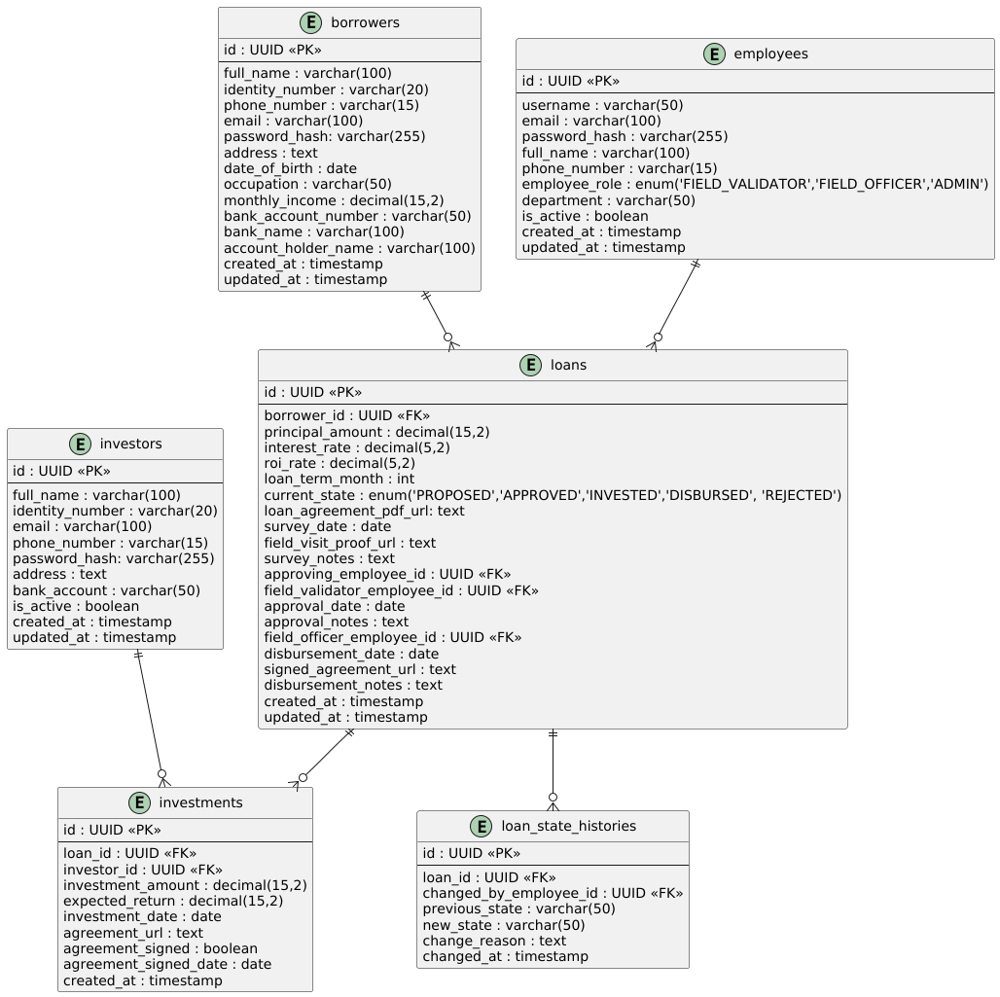

## Tech Stack

- **Backend**: Go (Golang) with Chi Router
- **Database**: PostgreSQL with PGX driver
- **Authentication**: JWT tokens
- **PDF Generation**: gofpdf library
- **Migrations**: golang-migrate
- **Configuration**: Viper
- **Logging**: Zerolog

---

### ERD

---

## API Spec

### API Endpoints
| No. | Fungsionalitas                  | HTTP Method | Endpoint                                    | Current |
|:----| :------------------------------ | :---------- |:--------------------------------------------|---------|
| 1.  | Login User                      | `POST`      | `/api/v1/auth/login`                        |     ✅    |
| 2.  | Create Loan Proposal            | `POST`      | `/api/v1/loans`                             |       ✅  |
| 3.  | Approve Loan                    | `PUT`       | `/api/v1/loans/{id}/approve`                |      ✅   |
| 4.  | Disburse Loan                   | `PUT`       | `/api/v1/loans/{id}/disburse`               |      ✅   |
| 5.  | List Available Loans for Investment | `GET`       | `/api/v1/loans/available`                   |     ❌    |
| 6.  | Make Investment in Loan         | `POST`      | `/api/v1/loans/{id}/investments`            |       ✅   |
| 7.  | Get Investor's Investment Portfolio | `GET`       | `/api/v1/investors/{investor_id}/portfolio` |   ❌      |
| 8.  | Upload Document Files           | `POST`      | `/api/v1/files/upload`                      |     ✅     |
| 9.  | Download/View Document          | `GET`       | `/api/v1/files/{file_id}`                   |    ❌     |
| 10. | Basic Health Check              | `GET`       | `/api/v1/__health`                          |       ✅   |

For endpoint in `current` status ❌  will develop in next plan.

